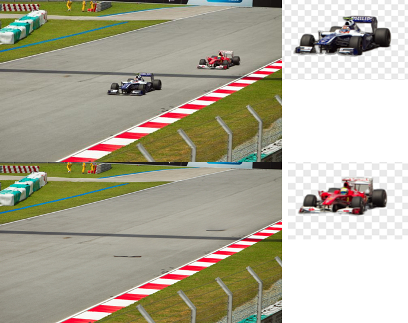

<div align="center">
    <h1> LaDeco - Layer Decomposer </h1>
</div>
<div align="center">
    
    
    
    
</div>

## Layer Decomposer
This repository is to provide method and tool to decompose image layers. The tool is based on deep learning methods of Matting-Anything (MAM, for image matting), and LaMa (for image inpainting) and traditional vision methods.


<div align="center">
    Top-Left: Input Image; Top-Right: Object Layer 1; Bottom-Right: Object Layer 2; Bottom-Left: Background Layer
</div>

## Get Start
### download this repository
```bash
git clone https://github.com/izayoi-luno/LaDeco.git
cd LaDeco
```
### install dependencies
```bash
# import torch (please refer to your cuda version)
# currently cuda is required
pip install torch torchvision torchaudio
# import other dependencies
pip install -r requirements/inp_requirements.txt
pip install -r requirements/mat_requirements.txt
```
### download pretrained models
```bash
mkdir pretrained
cd pretrained

# download matting model weights (MAM) from the following URL
https://drive.google.com/drive/folders/1Bor2jRE0U-U6PIYaCm6SZY7qu_c1GYfq?usp=sharing

# download inpainting model weights and configs (lama)
# if you are using Windows, you can click into the URL and unzip manually
curl -LJO https://huggingface.co/smartywu/big-lama/resolve/main/big-lama.zip
unzip big-lama.zip
```

### download Datasets (optional)
```bash
# download SA-1B Dataset from the following URL:
https://ai.meta.com/datasets/segment-anything-downloads/
```
## Inference with pretrained models
### Point prompts (SAM-Style)
```bash
# by mouse click example:
python main.py --img_path doc/images/sa_40.jpg --input_mode mouse

# by keyboard input example:
python main.py --img_path doc/images/sa_40.jpg --input_mode keyboard --prompt 798 795 1
```
### All the provided arguments please refer to the list below or use:
```bash
python main.py -h 
# or
python main.py --help
```
| Argument | Type   | Default                                  | Choices                                     | Required | Description                                      |
|----------|--------|------------------------------------------|---------------------------------------------|----------|--------------------------------------------------|
| `-img_path`, `--img_path` | `str`  | `None`                                   | N/A                                         | Yes      | Path to the image to be processed                |
| `-out_path`, `--out_path` | `str`  | `./results`                              | N/A                                         | No       | Path to the output results                       |
| `-infer_type`, `--infer_type` | `str`  | `'photo'`                                | `['photo', 'video', 'photo_set']`            | No       | Inferencer type                                  |
| `-front_side`, `--front_side` | `str`  | `'matte'`                                | `['matte', 'segment']`                       | No       | Front side of the decomposition                  |
| `-back_side`, `--back_side` | `str`  | `'inpaint'`                              | N/A                                         | No       | Back side of the decomposition                   |
| `-input_mode`, `--input_mode` | `str`  | `'keyboard'`                             | `['keyboard', 'mouse']`                      | No       | Input mode                                       |
| `-prompt_mode`, `--prompt_mode` | `str`  | `'point'`                                | `['box', 'point', 'text']`                   | No       | Mode of the prompt input                         |
| `-prompt`, `--prompt`     | `int`  | `None`                                   | N/A                                         | No       | Coordinates of the point prompt `[coord_W coord_H]` |
| `-seg_type`, `--seg_type` | `str`  | `'vit_h'`                                | `['vit_h', 'vit_l', 'vit_b']`                | No       | Segment Anything Model (SAM) type                |
| `-seg_ckpt`, `--seg_ckpt` | `str`  | `'./pretrained/sam_vit_h_4b8939.pth'`     | N/A                                         | No       | SAM checkpoint                                   |
| `-seg_infer_type`, `--seg_infer_type` | `str`  | `'auto'`                                 | `['auto', 'manual']`                         | No       | Segment inferencer type                          |
| `-multimask`, `--multimask` | `store_true` | `False`                                  | N/A                                         | No       | Whether to use multimask output                  |
| `-mat_config`, `--mat_config` | `str`  | `'./configs/mam_configs/MAM-ViTB-8gpu.toml'` | N/A                                         | No       | Matte model configurations                       |
| `-mat_ckpt`, `--mat_ckpt` | `str`  | `'./pretrained/mam_vitb.pth'`            | N/A                                         | No       | MAM checkpoint                                   |
| `-osn_width`, `--osn_width` | `int`  | `[10, 20, 10]`                           | N/A                                         | No       | Guidance threshold                               |
| `-twoside`, `--twoside`   | `store_true` | `False`                                  | N/A                                         | No       | Post-process with two sides of the guidance      |
| `-sam`, `--sam`           | `store_true` | `False`                                  | N/A                                         | No       | Return mask                                      |
| `-maskguide`, `--maskguide` | `store_true` | `False`                                  | N/A                                         | No       | Mask guidance                                    |
| `-postprocess`, `--postprocess` | `store_true` | `False`                                  | N/A                                         | No       | Post-process to remove background                |
| `-target_length`, `--target_length` | `int`  | `1024`                                   | N/A                                         | No       | Target length of the input image                 |
| `-inp_config`, `--inp_config` | `str`  | `'configs/lama_configs/predict/predict.yaml'` | N/A                                         | No       | Lama config path                                 |
| `-inp_ckpt`, `--inp_ckpt` | `str`  | `'./pretrained/big-lama/'`               | N/A                                         | No       | Lama checkpoint                                  |
| `-mod`, `--mod`           | `int`  | `8`                                      | N/A                                         | No       | Inpainting modulo                                |
| `-device`, `--device`     | `str`  | `'cuda'`                                 | `['cuda', 'cpu']`                           | No       | Device                                           |